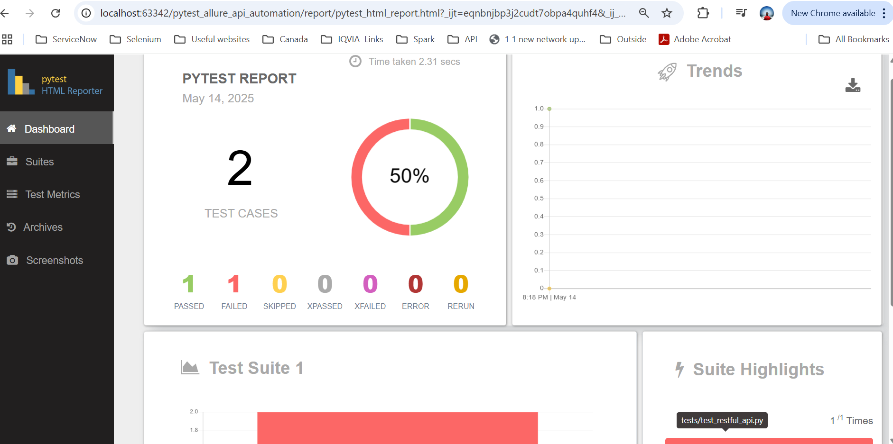
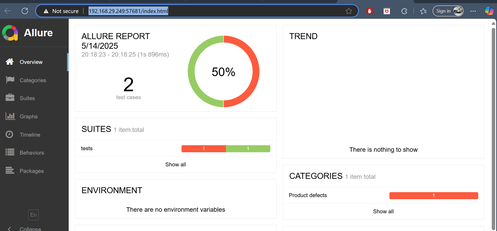

# pytest_allure_api_automation

- python --version
- python -m venv virtualenv1
- .\virtualenv1\Scripts\activate
- Install requirements.txt using below command
- pip install -r requirements.txt

- Below is the command to run test and generate reports
python -m pytest .\tests\test_restful_api.py --html-report=./report
 --alluredir=allure-results

- Below commands are used to generate Allure Report
  1. allure generate allure-results -o allure-report --clean
  2. allure open allure-report

#### Report1 : pytest htmlreporter 

 
#### Report2: Allure Report
